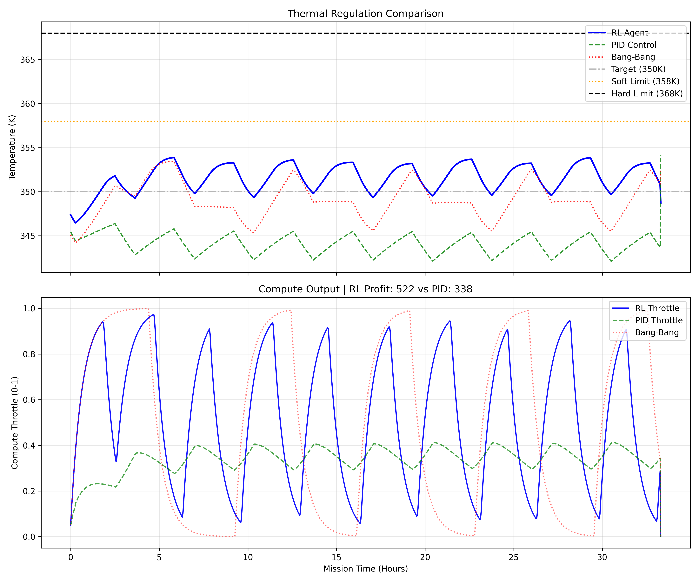
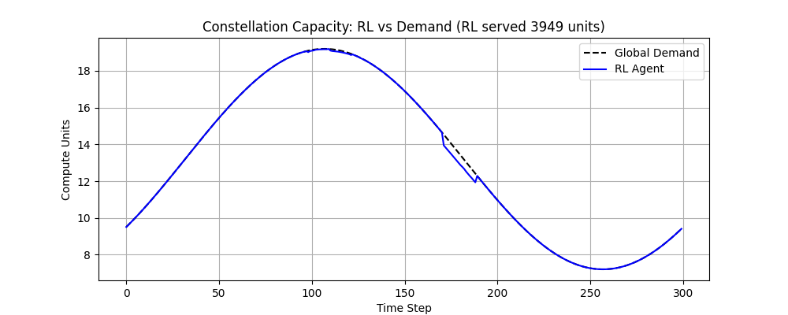

<div align="center">

# 🛰️ RL-Space-Datacenter
**Orchestrating GPU Datacenters in Low Earth Orbit using Reinforcement Learning**

[](https://python.org)
[](https://stable-baselines3.readthedocs.io/)
[](https://rhodesmill.org/skyfield/)

</div>

## 🌌 The Concept
As Earth-based datacenters consume unsustainable amounts of power, space-based computing offers a radical alternative. However, running AI hardware (like NVIDIA H100s) in the vacuum of space presents a massive engineering challenge: **Thermal Rejection**. With no air to cool the GPUs, heat must be radiated away. If a satellite runs continuous heavy compute workloads, it will overheat and destroy itself.

This project simulates orbital mechanics, solar heating, and NVIDIA H100 thermal physics to solve this. Using Proximal Policy Optimization (PPO), the Reinforcement Learning agent discovers novel thermal management strategies that outperform classical control theory.

---

## 🚀 Emergent Behaviors Discovered

### 1. "Thermal Mass as a Battery" (Single Satellite)
When challenged to maximize compute without exceeding 368K, the agent rejected simple steady-state operation. Instead, it discovered **duty-cycling**: aggressively pulsing the GPU to 100% to maximize revenue, riding the temperature curve up to a safe margin, and then shutting down to radiate heat.

**Result:** The RL agent extracts **54% more compute throughput** than an optimized PID baseline while maintaining strict thermal safety.

<div align="center">
  
  <p><i>The RL Agent (Blue) strategically "overdrives" the satellite, vastly outperforming the conservative smooth profile of the PID Controller (Green).</i></p>
</div>

---

### 2. "Following the Shade" (24-Sat Constellation)
Scaling up, I implemented a centralized RL dispatcher to manage a 24-satellite **Walker Delta Constellation**. The dispatcher receives a global compute demand signal and must distribute the load across the fleet. 

The agent learns orbital thermal dynamics without explicit prompting: it dynamically routes heavy workloads to satellites currently passing through Earth's eclipse (where radiative cooling is maximum) allowing sun-baked satellites to cool down.

<div align="center">
  
  <p><i>Fleet-wide load balancing: The dispatcher routes high throttle (middle) to manage fleet temperatures (top).</i></p>
</div>

<div align="center">
  
  <p><i>The RL agent successfully serves ~90% of global demand while operating within strict thermal guardrails.</i></p>
</div>

---

## ⚙️ Physics Engine Detail
- **Radiative Cooling:** Stefan-Boltzmann T⁴ dynamics based on realistic spacecraft surface areas.
- **Orbital Mechanics:** Real TLE propagation (Skyfield) integrating solar/eclipse states and Earth IR albedo.
- **Kessler Syndrome Avoidance:** KD-Tree implementation tracking 14,000+ debris objects simultaneously, enforcing fuel-constrained collision avoidance maneuvers.

## 🛠️ Tech Stack
* **RL Framework:** `stable-baselines3` (PPO, Vectorized Environments)
* **Environment:** Custom `gymnasium` (Multi-objective optimization)
* **Astrodynamics:** `skyfield`, `numpy`, `scipy`

## 💻 Running the Code

**1. Clone & Install**
```bash
git clone https://github.com/Aditya-Agarwal2006/con.git
cd con
pip install -r requirements.txt # Standard data science/RL stack
```

**2. Verify the Single-Agent Baseline (Phase 1)**
Run the comparison script to pit the RL agent against classical PID and Bang-Bang controllers:
```bash
python compare_baselines.py
```

**3. Test the Constellation Dispatcher (Phase 2)**
Train a 10k-step pilot model and generate the fleet-wide heatmaps:
```bash
./run_phase2_demo.sh
```
